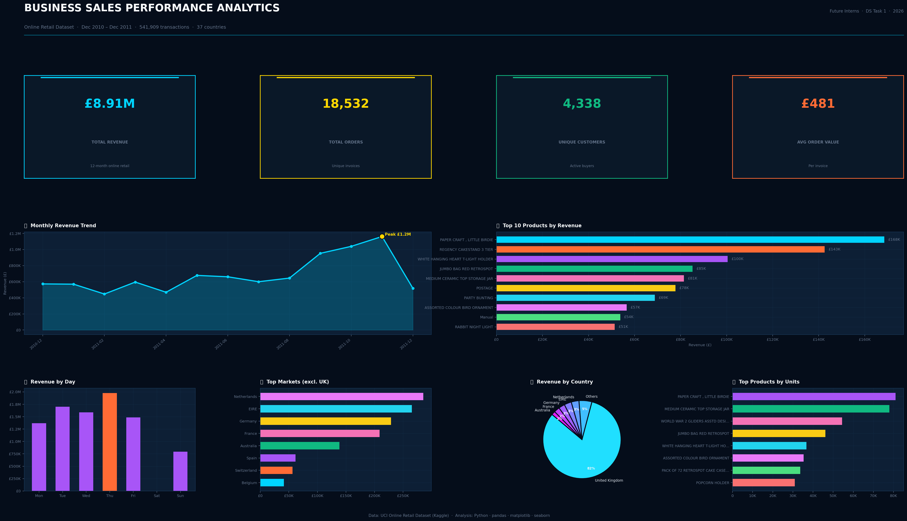

# FUTURE_DS_01
Future Interns Data Science, Analytics Internship
Task 1 - Business Sales Performance Analytics 
Tools: VS CODE

# FUTURE_DS_01 - Business Sales Performance Analytics
Intern: Nkosinathi Mathienjwa  
CIN ID: FIT/APR26/DS16645  
Organization: Future Interns  
Track: Data Science & Analytics

## Overview
Analysed a real-world e-commerce dataset (UCI Online Retail) containing over 540,000 transactions to uncover revenue trends, top-performing products, and key international markets. Analyzed business sales data to identify revenue trends, top-selling 
products, high-value categories, and regional performance.

## Key Findings

| Metric            | Value |

| Total Revenue     | £8,911,407.90 |
| Total Orders      | 18,532 |
| Unique Customers  | 4,338 |
| Avg Order Value   | £480.87 |

**Top Products by Revenue**
1. Paper Craft, Little Birdie — £168,469
2. Regency Cakestand 3 Tier — £142,592
3. White Hanging Heart T-Light Holder — £100,448

**Top Markets (excl. UK)**
- Netherlands (3.2%), EIRE (3.0%), Germany (2.6%), France (2.3%)

**Best Sales Day:** Thursday

## Dashboard Preview

## Recommendations
- Stock up on top products ahead of Quarter4 — the Nov/Dec spike is significant
- Netherlands and EIRE are the strongest international markets and worth investing in
- Run promotions on slower weekdays to balance order volume
- Introduce a loyalty programme — repeat customers drive the majority of revenue

## Tools Used
- Python 3
- pandas, matplotlib, seaborn

## Dataset
[UCI Online Retail Dataset via Kaggle](https://www.kaggle.com/datasets/ulrikthygepedersen/online-retail-dataset)

## How to Run
1. Clone the repo and place `online_retail.csv` in the same folder
2. Install dependencies: `pip install pandas matplotlib seaborn`
3. Run: `python online_retail_analysis.py`
4. Dashboard saved as `sales_dashboard.png`